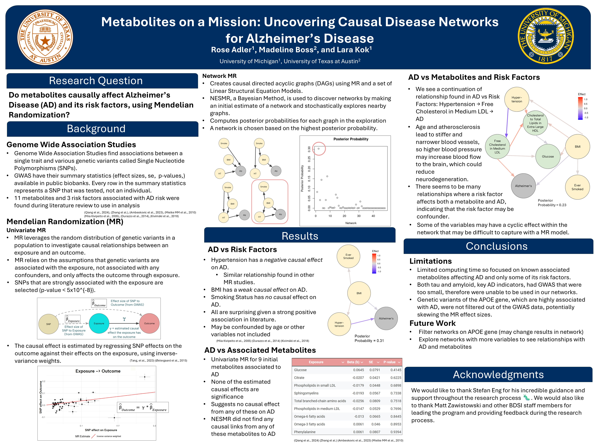

------------------------------------------------------------------------

### **Research Intern at Big Data Summer Institute at University of Michigan**
##### Ann Arbor, MI
###### Summer 2025

During her 2nd summer, Madeline was a research intern for the University of Michigan. Throughout the six week program, Madeline did a mix of graduate level data science training and genomic research. Graduate level training include causal inference, survival analysis, and machine learning. To learn more about the program go to [Big Data Summer Institute Website](https://sph.umich.edu/bdsi/)

Her research was focused on discovering causal relationships between metabolites and Alzhiemer's Disease and it's risk factors. She worked with over 250 Genome Wide Assoication Studies (GWAS) to discover correaltions between different metabolites and risk factors during variable selection. She also ran Medenlaion Randomization Network Anaylsis on a variety of metabolites and risk factors.

She presented her research at the University of Michigan Research Sysposium to over 40 current researchers in the Biostatisics field. She also created a poster of her findings which is shown below.

{#id .class width=100% height=100%}

------------------------------------------------------------------------

### **Undergraduate Course Assistant at UT Austin**
##### Austin, TX
###### August 2024 - Present

Since her second year, Madeline has worked during the school year as a Undergraduate Course Assistant (UGCA) in Statistics and Data Science Department of UT Austin. She has taught *Intro to Data Science* twice and *Statistical Thinking*, with an average of 100 students per class.

As a UGCA, she helps grade weekly homeworks, labs, and personal projects. Particularly for personal projects, she also assists as a mentor to guide students through the project process. Outside of grading, she also hosts 2 hour office hours weekly and assists students during regular class.

------------------------------------------------------------------------

### **Research Intern at Heartland Forward**
##### Bentonville, AR
###### Summers 2023 and 2024

In her summer before high school and her 1st summer in undergraduate she worked as a Research Intern for a think do tank called [Heartland Forward](https://heartlandforward.org/). In her role, she cleaned and visualized over 20+ data sets in a variety of topics in Tableau. This include rural mental health, drug overdose, maternal health care, venture capital, and outdoor recreation. 

She also conducted a variety of literature reviews for upcoming research projects, which help to structure research questions and find datasets for analysis. 
